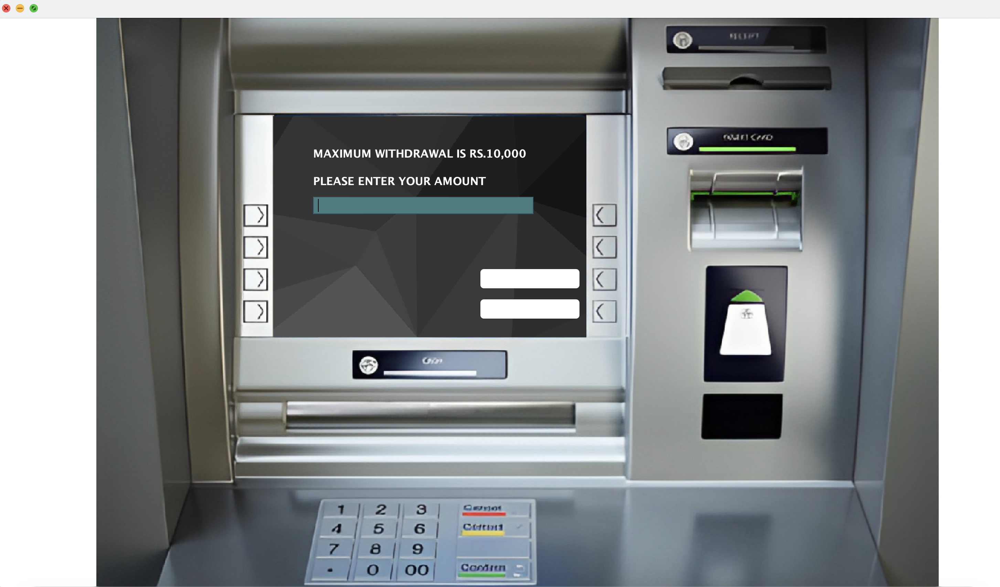

# 🏦 Banking System – Java Swing Desktop Application

## 📌 Overview

This project is a **Java-based Desktop Banking System** developed using **Java Swing** for the graphical user interface and **Core Java** concepts for business logic.
The application simulates real-world banking operations such as account management, transactions, and user authentication in a secure and user-friendly desktop environment.

---

## 🚀 Features

* 🔐 User authentication (Login system)
* 🧾 Create and manage bank accounts
* 💰 Deposit and withdrawal operations
* 🔄 Fund transfer between accounts
* 📊 View account balance and transaction details
* 🖥️ Interactive GUI built using Java Swing

---

## 🛠️ Tech Stack

* **Programming Language:** Java
* **GUI Framework:** Java Swing
* **Concepts Used:**

  * Object-Oriented Programming (OOP)
  * Event Handling
  * Exception Handling
  * Modular Class Design

---

## 📂 Project Structure

```
Banking_System/
│── src/
│   ├── Main.java
│   ├── Login.java
│   ├── Dashboard.java
│   ├── Account.java
│   └── Transaction.java
│── README.md
```

---

## ▶️ How to Run the Project

1. Clone the repository:

   ```bash
   git clone https://github.com/AbhishekRajvanshi07/Banking_System.git
   ```
2. Open the project in **IntelliJ IDEA / Eclipse / VS Code**
3. Compile and run:

   ```bash
   javac Main.java
   java Main
   ```

> ⚠️ Note: This is a **desktop application**, not a web application.

---


## 📸 Screenshots

### 🔐 Sign In Page


### 📝 Application Form – Step 1


### 📝 Application Form – Step 2


### 📝 Application Form – Step 3


### 💸 Withdrawal


### 💰 Balance Enquiry


---


## 👤 Author

**Abhishek Rajvanshi**
Engineering Student | Java & Full-Stack Developer

---
